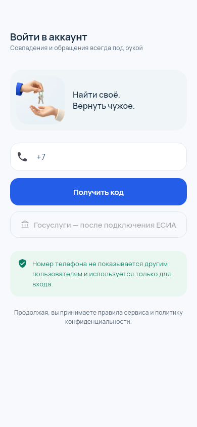

# Mobile design review

These screenshots come from the actual Flutter renderer at commit `dd547b8fc553f7e3fe499ccfdd3601a5907c998d`, using synthetic account/listing data. They show a 390 × 844 logical-pixel viewport with 44 px top and 34 px bottom safe areas, real bundled fonts and decoded artwork. They are not physical iPhone screenshots. System status indicators and the keyboard are outside these captures.

See `flutter/test/mobile_design_test.dart` for capture and mobile interaction checks, and `flutter/assets/README.md` for artwork prompts and font licensing.
